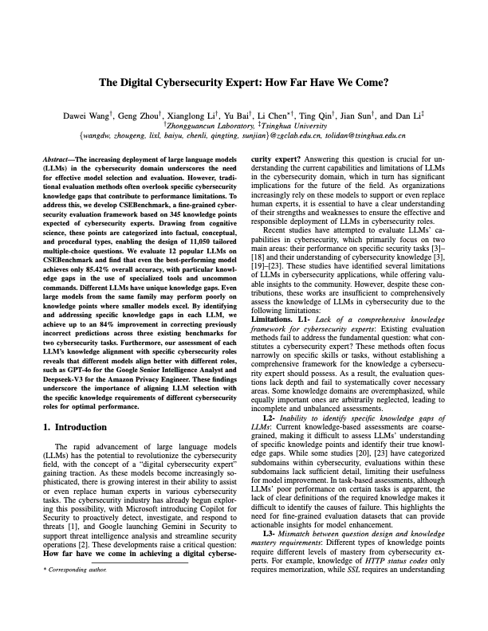
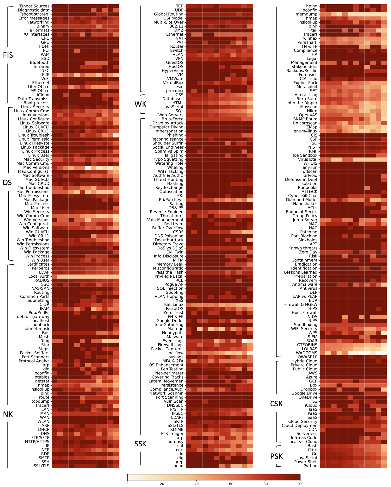
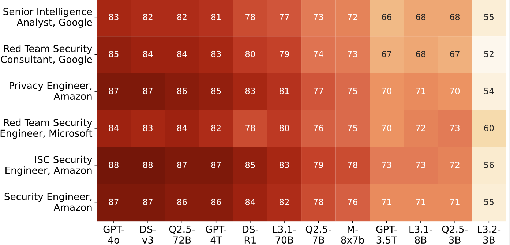
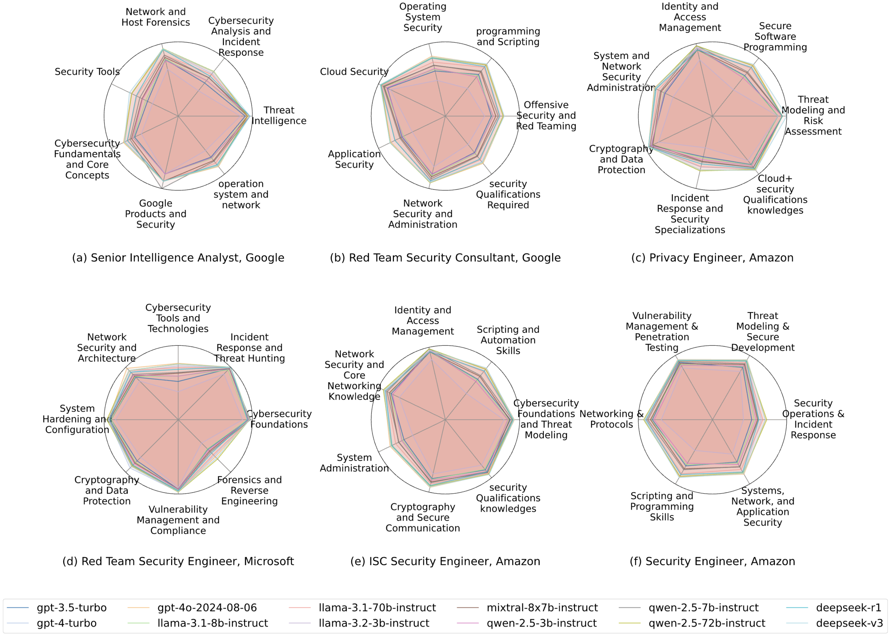

# CSEBenchmark - Cyber Security Expert Benchmark

<p><a href="https://arxiv.org/abs/2504.11783"></a></p>

The implementation of the paper titled **"The Digital Cybersecurity Expert: How Far Have We Come?"**

CSEBenchmark is the first cognitive science-based, fine-grained knowledge assessment framework, encompassing 345 fine-grained knowledge points across seven key subdomains critical for cybersecurity experts.

For more details, please refer to [our paper](https://arxiv.org/abs/2504.11783) from IEEE S&P'25.

## Structure ##

```
.
├── README.md
├── config
├── dataset
│   ├── csebench_A.json
│   ├── csebench_B.json
│   ├── csebench_C.json
│   └── csebench_D.json
├── knowledge_framework.json
├── results
├── scripts
│   ├── format_xfinder_results.py
│   └── get_answer.py
└── xfinder
```

1. [knowledge_framework.json](knowledge_framework.json): Knowledge framework file.
2. [config/.env](config/.env): Config file to specify your OPENAI_API_KEY.
3. [dataset/csebench_[A|B|C|D]](dataset): Questions under the distribution of four options.
4. [results/](results): Dir to store the results.
5. [scripts/get_answer.py](scripts/get_answer.py): Script to query LLMs for answers
6. [scripts/format_xfinder_results.py](scripts/format_xfinder_results.py): Script to format xFinder output format to final results format
7. [xfinder/](xfinder/): Modified xFinder library

## Usage ##

```
# 1. Configure your OPENAI_API_KEY in the config/.env file (not required for non-GPT models).

echo "OPENAI_API_KEY=\"sk-YOURAPIKEY\"" > config/.env

# 2. Query LLMs for answers (e.g., GPT-4o, using 15 parallel processes), the results are saved as results/results_{model}_{type}_{choice}.json.

python3 scripts/get_answer.py --model gpt-4o --worker 15

# 3. Use xFinder to retrieve the answers.

conda create -n xfinder_env python=3.10 -y
conda activate xfinder_env
pip install -e ./xfinder
python -m xfinder.eval --run-example --model-name xFinder-llama38it --inference-mode local --model-path-or-url /path/to/xFinder-llama38it --json-path /path/to/results_file

# 4. Format the xFinder output into the final results structure. This script will process all xFinder output files located in the results/ directory and save them as results/results_{model}_{type}_{choice}_final.json.

python3 scripts/format_xfinder_results.py
```

## Distribution ##

|**Subdomain**|**Type**|**#Knowledge**|**#Tokens**|**#Questions**|
|---|---|---|---|---|
|**Fundamental IT Skills (FIS)**|Factual|21|19.8K|124|
||Conceptual|2|3.3K|12|
||Procedural|2|18.7K|25|
|**Operating Systems (OS)**|Factual|5|8.4K|25|
||Conceptual|18|0.3M|433|
||Procedural|16|0.4M|650|
|**Networking Knowledge (NK)**|Factual|30|14.9K|168|
||Conceptual|31|0.6M|757|
||Procedural|12|93.2K|140|
|**Web Knowledge (WK)**|Factual|0|0|0|
||Conceptual|0|0|0|
||Procedural|6|1.8M|2202|
|**Security Skills and Knowledge (SSK)**|Factual|50|22.2K|268|
||Conceptual|79|0.9M|1040|
||Procedural|46|2.0M|2451|
|**Cloud Skills and Knowledge (CSK)**|Factual|15|15.7K|75|
||Conceptual|6|91.3K|144|
||Procedural|0|0|0|
|**Programming Skills and Knowledge (PSK)**|Factual|0|0|0|
||Conceptual|0|0|0|
||Procedural|6|2.0M|2536|
|**Count**||**345**|**8.4M**|**11,050**|


## LeaderBoard ##

### Overall ###

|Model|FIS|OS|NK|WK|SSK|CSK|PSK|Factual|Conceptual|Procedural|Overall|
|---|---|---|---|---|---|---|---|---|---|---|---|
|GPT-4o|95.65|**82.67**|92.39|**86.15**|**80.26**|97.26|89.04|**94.85**|**94.84**|**81.83**|**85.42**|
|DeepSeek-V3|93.79|81.32|91.92|84.65|79.70|**97.72**|**89.87**|94.24|94.26|81.37|84.92|
|Qwen-2.5-72B|**96.27**|80.60|**92.58**|84.11|79.76|96.35|87.97|94.24|94.59|80.55|84.40|
|GPT-4-Turbo|92.55|80.60|91.46|84.74|78.21|95.89|88.13|93.64|93.88|80.07|83.86|
|DeepSeek-R1|91.93|79.87|89.86|79.16|74.79|96.80|85.29|91.67|92.58|76.14|80.62|
|Llama-3.1-70B|91.30|74.37|88.64|80.79|74.57|95.43|84.15|92.42|93.34|75.00|80.00|
|Qwen-2.5-7B|91.30|69.58|87.23|72.93|70.44|93.61|77.68|90.45|91.32|68.72|74.90|
|Mixtral-8x7B|86.34|69.95|84.32|72.48|68.79|92.24|76.30|88.33|89.52|67.62|73.58|
|Llama-3.1-8B|88.20|64.08|83.19|67.71|65.28|92.24|69.91|86.06|88.60|62.17|69.30|
|GPT-3.5-Turbo|87.58|61.91|81.03|67.94|62.92|87.67|71.77|86.82|86.25|61.62|68.44|
|Qwen-2.5-3B|87.58|65.25|79.72|64.80|65.79|88.13|67.67|87.58|86.34|61.02|68.07|
|Llama-3.2-3B|80.75|48.83|70.61|49.41|51.74|83.56|47.79|80.00|78.54|43.09|52.95|


### Knowledge Gaps ##

Here is the heatmap of accuracy across 345 knowledge points for ten models. The y-axis labels denote individual knowledge points, with subdomain
names in parentheses for grouped items. Each section contains ten columns representing models from left to right: GPT-4o, Deepseek-V3, Qwen-2.5-72B,
GPT-4-Turbo, Deepseek-R1, Llama-3.1-70B, Qwen-2.5-7B, Mixtral-8x7B, GPT-3.5-Turbo, Llama-3.1-8B, Qwen-2.5-3B, Llama-3.2-3B.



### Job Role Knowledge Alignment ###

To evaluate how well these LLMs’ knowledge aligns with the specific requirements of real-world cybersecurity positions, we gather job requirements from companies such as Amazon, Google, and Microsoft. Based on role descriptions, we manually map these requirements to our knowledge points. In total, we identify six distinct roles for the analysis: Google’s Senior Intelligence Analyst and Red Team Security Consultant, Amazon’s Privacy Engineer, ISC Security Engineer, and Security Engineer, and Microsoft’s Red Team Security Engineer. The mapped knowledge points for each job role is provided in [job_map.json](assets/extras/job_map.json).





## Contribute ##

We sincerely appreciate your interest in improving CSEBenchmark. While the dataset has undergone **672 hours of dedicated human verification and refinement**, there may still be occasional errors or oversights. If you come across any issues, we would be **grateful** if you could submit a Pull Request (PR) to help us make corrections.

Moreover, if you have **additional knowledge points** or **carefully curated, human-reviewed questions** that align with the scope of CSEBenchmark, we would be **delighted** to consider your contributions. Expanding the dataset with diverse, high-quality content is a collaborative effort, and your input is always welcome.

Thank you for helping us make CSEBenchmark more accurate, comprehensive, and useful for the community!

## Credit ##

Thanks to Dawei Wang ([@4ugustus](https://github.com/waugustus)), Geng Zhou ([@Arbusz](https://github.com/Arbusz)), and Xianglong Li ([@ybhl](https://github.com/yhblkey)) for their valuable contributions to this project.

## Citing This Paper ##

In case you would like to cite CSEBenchmark, you may use the following BibTex entry:

```
@inproceedings {wang2025csebenchmark,
  title = {The Digital Cybersecurity Expert: How Far Have We Come?},
  author = {Wang, Dawei and Zhou, Geng and Li, Xianglong and Bai, Yu and Chen, Li and Qin, Ting and Sun, Jian and Li, Dan},
  booktitle = {2025 IEEE Symposium on Security and Privacy (SP)},
  publisher = {Association for Computing Machinery},
  organization={IEEE},
  pages = {},
  year = {2025}
}
```

## Star History ##

[](https://starchart.cc/NASP-THU/CSEBenchmark)
